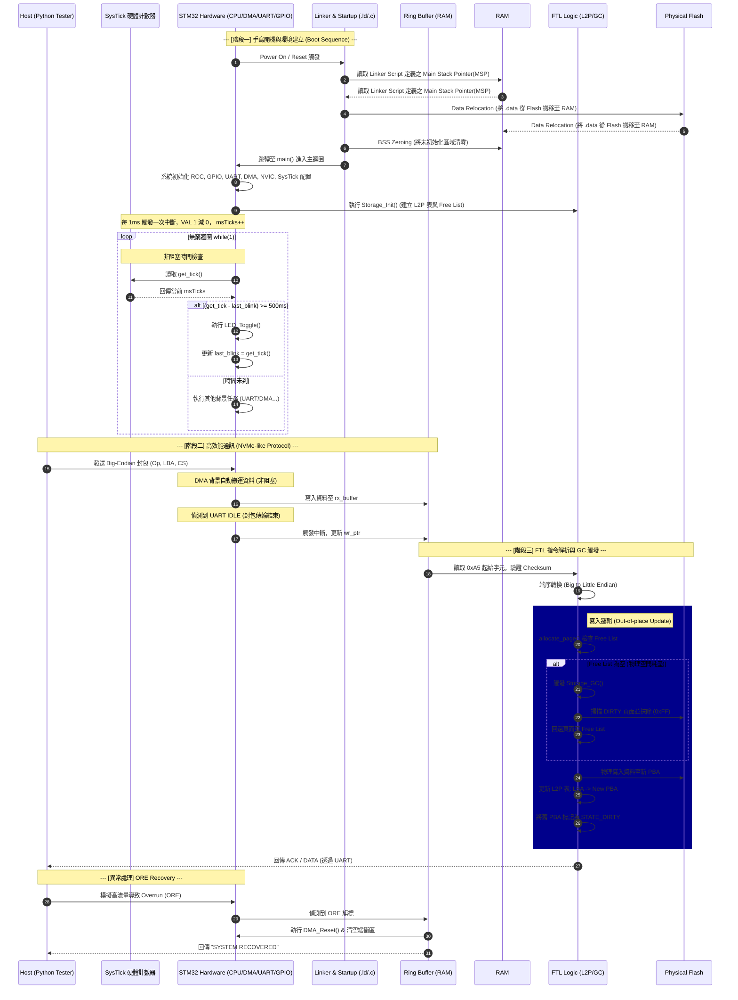
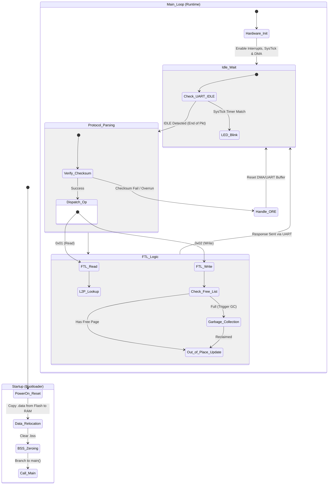
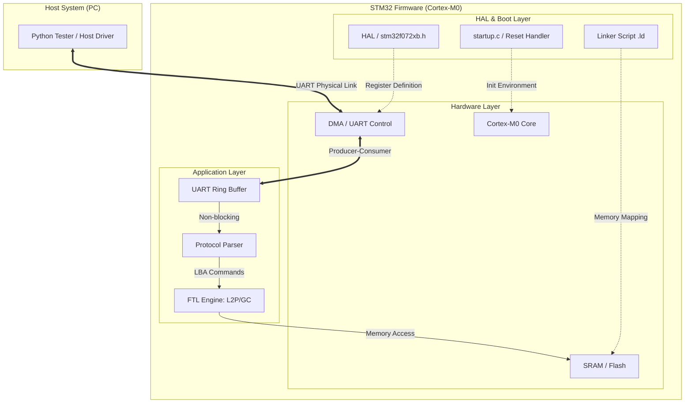
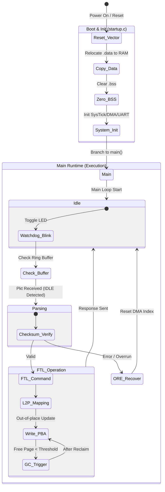

### 系統時序圖 (Sequence Diagram)

```mermaid
sequenceDiagram
    autonumber
    
    participant PC as Host (Python Tester)
    participant Systick as SysTick 硬體計數器
    participant HW as STM32 Hardware (CPU/DMA/UART/GPIO)
    participant Startup as  Linker & Startup (.ld/.c)
    participant Buffer as Ring Buffer (RAM)
    participant Ram as RAM
    participant FTL as FTL Logic (L2P/GC)
    participant Storage as Physical Flash

    Note over HW, Startup: --- [階段一] 手寫開機與環境建立 (Boot Sequence) ---
    
    HW->>Startup: Power On / Reset 觸發
    Startup->>Ram: 讀取 Linker Script 定義之 Main Stack Pointer(MSP)
    Ram-->>Startup: 讀取 Linker Script 定義之 Main Stack Pointer(MSP)
    Startup->>Storage: Data Relocation (將 .data 從 Flash 搬移至 RAM)
    Storage-->>Ram: Data Relocation (將 .data 從 Flash 搬移至 RAM)
    Startup->>Ram: BSS Zeroing (將未初始化區域清零)

    Startup->>HW: 跳轉至 main() 進入主迴圈
    HW->>HW: 系統初始化 RCC, GPIO, UART, DMA, NVIC, SysTick 配置
    HW->>FTL: 執行 Storage_Init() (建立 L2P 表與 Free List)

    Note over Systick, HW: 每 1ms 觸發一次中斷，VAL 1 減 0， msTicks++
    loop 無窮迴圈 while(1)
        Note over HW, Systick: 非阻塞時間檢查
        HW->>Systick: 讀取 get_tick()
        Systick-->>HW: 回傳當前 msTicks
        
        alt (get_tick - last_blink) >= 500ms
            HW->>HW: 執行 LED_Toggle()
            HW->>HW: 更新 last_blink = get_tick()
        else 時間未到
            HW->>HW: 執行其他背景任務 (UART/DMA...)
        end
    end
    

    Note over PC, Buffer: --- [階段二] 高效能通訊 (NVMe-like Protocol) ---

    PC->>HW: 發送 Big-Endian 封包 (Op, LBA, CS)
    Note over HW: DMA 背景自動搬運資料 (非阻塞)
    HW->>Buffer: 寫入資料至 rx_buffer
    Note over HW: 偵測到 UART IDLE (封包傳輸結束)
    HW->>Buffer: 觸發中斷，更新 wr_ptr

    Note over Buffer, Storage: --- [階段三] FTL 指令解析與 GC 觸發 ---

    Buffer->>FTL: 讀取 0xA5 起始字元，驗證 Checksum
    FTL->>FTL: 端序轉換 (Big to Little Endian)
    
    rect rgb(0, 0, 139)
        Note right of FTL: 寫入邏輯 (Out-of-place Update)
        FTL->>FTL: allocate_page() 檢查 Free List
        alt Free List 為空 (物理空間耗盡)
            FTL->>FTL: 觸發 Storage_GC()
            FTL->>Storage: 掃描 DIRTY 頁面並抹除 (0xFF)
            FTL->>FTL: 回還頁面至 Free List
        end
        FTL->>Storage: 物理寫入資料至新 PBA
        FTL->>FTL: 更新 L2P 表: LBA -> New PBA
        FTL->>FTL: 將舊 PBA 標記為 STATE_DIRTY
    end

    FTL-->>PC: 回傳 ACK / DATA (透過 UART)
    
    Note over PC, HW: --- [異常處理] ORE Recovery ---
    PC->>HW: 模擬高流量導致 Overrun (ORE)
    HW->>Buffer: 偵測到 ORE 旗標
    Buffer->>HW: 執行 DMA_Reset() & 清空緩衝區
    Buffer-->>PC: 回傳 "SYSTEM RECOVERED"
```

### 系統生命週期與運作狀態圖 (State Diagram)

```mermaid  
stateDiagram-v2
    [*] --> PowerOn_Reset
    
    state "Startup (Bootloader)" as Startup {
        PowerOn_Reset --> Data_Relocation : Copy .data from Flash to RAM
        Data_Relocation --> BSS_Zeroing : Clear .bss
        BSS_Zeroing --> Call_Main : Branch to main()
    }

    state "Main_Loop (Runtime)" as Main {
        [*] --> Hardware_Init
        Hardware_Init --> Idle_Wait : Enable Interrupts, SysTick & DMA
        
        state Idle_Wait {
            [*] --> Check_UART_IDLE
            Check_UART_IDLE --> Protocol_Parsing : IDLE Detected (End of Pkt)
            Check_UART_IDLE --> LED_Blink : SysTick Timer Match
        }

        state Protocol_Parsing {
            [*] --> Verify_Checksum
            Verify_Checksum --> Dispatch_Op : Success
            Verify_Checksum --> Handle_ORE : Checksum Fail / Overrun
            
            state Dispatch_Op {
                [*] --> FTL_Read : 0x01 (Read)
                [*] --> FTL_Write : 0x02 (Write)
            }
        }

        state FTL_Logic {
            FTL_Read --> L2P_Lookup
            FTL_Write --> Check_Free_List
            Check_Free_List --> Out_of_Place_Update : Has Free Page
            Check_Free_List --> Garbage_Collection : Full (Trigger GC)
            Garbage_Collection --> Out_of_Place_Update : Reclaimed
        }
        
        Protocol_Parsing --> FTL_Logic
        FTL_Logic --> Idle_Wait : Response Sent via UART
        Handle_ORE --> Idle_Wait : Reset DMA/UART Buffer
    }
```

### 全系統架構圖 (System Architecture)

```mermaid
graph TB
    subgraph Host_System ["Host System (PC)"]
        Python[Python Tester / Host Driver]
    end

    subgraph STM32_Firmware ["STM32 Firmware (Cortex-M0)"]
        subgraph App_Layer ["Application Layer"]
            Parser[Protocol Parser]
            FTL[FTL Engine: L2P/GC]
            RB[UART Ring Buffer]
        end

        subgraph HAL_Boot_Layer ["HAL & Boot Layer"]
            Startup[startup.c / Reset Handler]
            HAL[HAL / stm32f072xb.h]
            LS[Linker Script .ld]
        end

        subgraph HW_Layer ["Hardware Layer"]
            DMA[DMA / UART Control]
            CPU[Cortex-M0 Core]
            MEM[SRAM / Flash]
        end
    end

    %% Relations
    Python <==>|UART Physical Link| DMA
    DMA <==>|Producer-Consumer| RB
    RB -->|Non-blocking| Parser
    Parser -->|LBA Commands| FTL
    FTL -->|Memory Access| MEM
    
    LS -.->|Memory Mapping| MEM
    Startup -.->|Init Environment| CPU
    HAL -.->|Register Definition| DMA
```
### 系統啟動與運行狀態機 (System State Machine)

```mermaid
stateDiagram-v2
    [*] --> Reset_Vector: Power On / Reset
    
    state "Boot & Init (startup.c)" as Boot {
        Reset_Vector --> Copy_Data: Relocate .data to RAM
        Copy_Data --> Zero_BSS: Clear .bss
        Zero_BSS --> System_Init: Init SysTick/DMA/UART
        System_Init --> Main: Branch to main()
    }

    state "Main Runtime (Execution)" as Execution {
        Main --> Idle: Main Loop Start
        
        state Idle {
            [*] --> Watchdog_Blink: Toggle LED
            Watchdog_Blink --> Check_Buffer: Check Ring Buffer
        }

        Check_Buffer --> Parsing: Pkt Received (IDLE Detected)
        
        state Parsing {
            [*] --> Checksum_Verify
            Checksum_Verify --> FTL_Command: Valid
            Checksum_Verify --> ORE_Recover: Error / Overrun
        }

        state FTL_Operation {
            FTL_Command --> L2P_Mapping
            L2P_Mapping --> Write_PBA: Out-of-place Update
            Write_PBA --> GC_Trigger: Free Page < Threshold
            GC_Trigger --> Write_PBA: After Reclaim
        }
        
        FTL_Operation --> Idle: Response Sent
        ORE_Recover --> Idle: Reset DMA Index
    }
```
