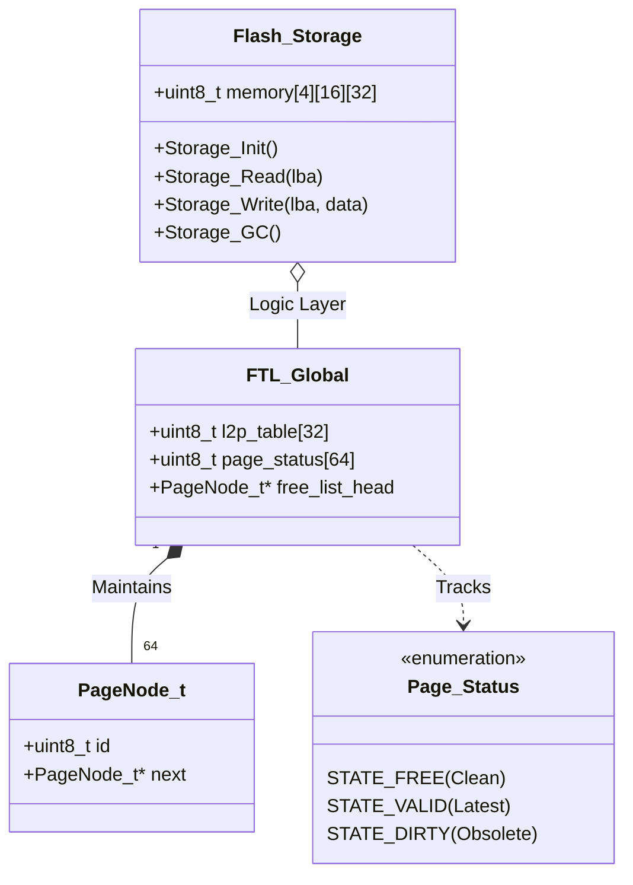
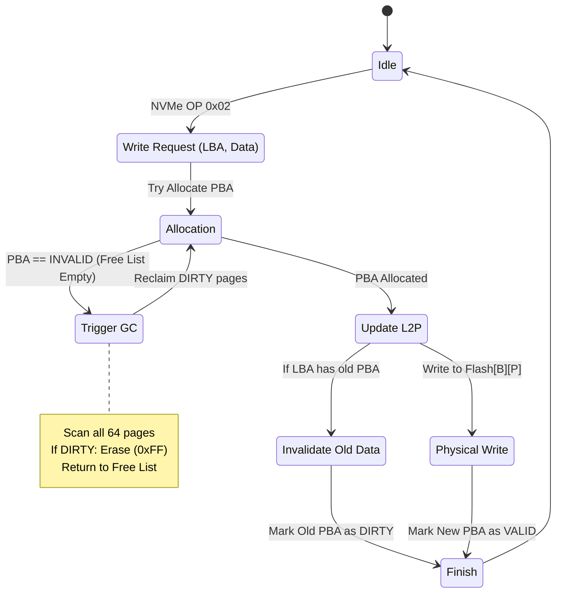
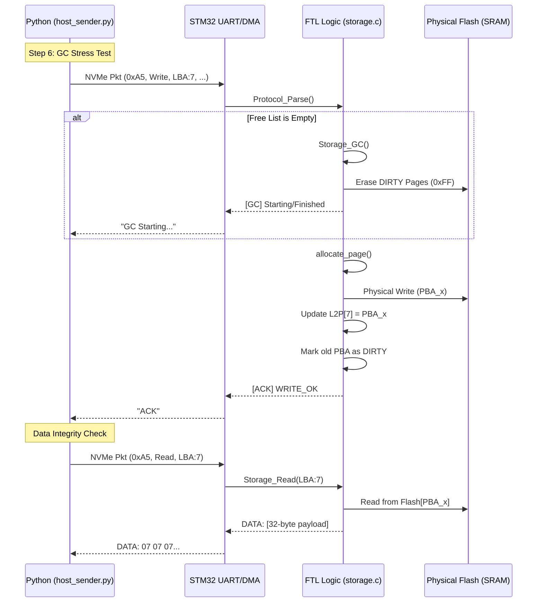

```mermaid
classDiagram
    class FTL_Global {
        +uint8_t l2p_table[32]
        +uint8_t page_status[64]
        +PageNode_t* free_list_head
    }

    class PageNode_t {
        +uint8_t id
        +PageNode_t* next
    }

    class Flash_Storage {
        +uint8_t memory[4][16][32]
        +Storage_Init()
        +Storage_Read(lba)
        +Storage_Write(lba, data)
        +Storage_GC()
    }

    class Page_Status {
        <<enumeration>>
        STATE_FREE (Clean)
        STATE_VALID (Latest)
        STATE_DIRTY (Obsolete)
    }

    FTL_Global "1" *-- "64" PageNode_t : Maintains
    FTL_Global ..> Page_Status : Tracks
    Flash_Storage o-- FTL_Global : Logic Layer
```

```mermaid
stateDiagram-v2
    [*] --> Idle

    state "Write Request (LBA, Data)" as Write
    Idle --> Write : NVMe OP 0x02

    state "Allocation" as Alloc
    Write --> Alloc : Try Allocate PBA
    
    state "Trigger GC" as GC
    Alloc --> GC : PBA == INVALID (Free List Empty)
    GC --> Alloc : Reclaim DIRTY pages
    
    state "Update L2P" as Update
    Alloc --> Update : PBA Allocated
    
    state "Invalidate Old Data" as Invalidate
    Update --> Invalidate : If LBA has old PBA
    Invalidate --> Finish : Mark Old PBA as DIRTY
    
    state "Physical Write" as PhysWrite
    Update --> PhysWrite : Write to Flash[B][P]
    PhysWrite --> Finish : Mark New PBA as VALID

    Finish --> Idle
    
    note right of GC
        Scan all 64 pages
        If DIRTY: Erase (0xFF)
        Return to Free List
    end note
```

```mermaid
sequenceDiagram
    participant Host as Python (host_sender.py)
    participant UART as STM32 UART/DMA
    participant FTL as FTL Logic (storage.c)
    participant Flash as Physical Flash (SRAM)

    Note over Host: Step 6: GC Stress Test
    Host->>UART: NVMe Pkt (0xA5, Write, LBA:7, ...)
    UART->>FTL: Protocol_Parse()
    
    alt Free List is Empty
        FTL->>FTL: Storage_GC()
        FTL->>Flash: Erase DIRTY Pages (0xFF)
        FTL-->>UART: [GC] Starting/Finished
        UART-->>Host: "GC Starting..."
    end

    FTL->>FTL: allocate_page()
    FTL->>Flash: Physical Write (PBA_x)
    FTL->>FTL: Update L2P[7] = PBA_x
    FTL->>FTL: Mark old PBA as DIRTY
    
    FTL-->>UART: [ACK] WRITE_OK
    UART-->>Host: "ACK"

    Note over Host: Data Integrity Check
    Host->>UART: NVMe Pkt (0xA5, Read, LBA:7)
    UART->>FTL: Storage_Read(LBA:7)
    FTL->>Flash: Read from Flash[PBA_x]
    FTL-->>UART: DATA: [32-byte payload]
    UART-->>Host: DATA: 07 07 07...
```
