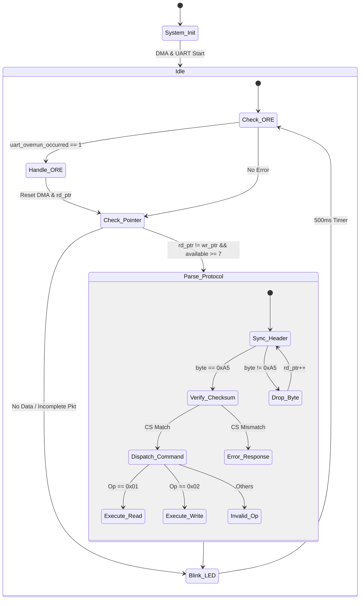
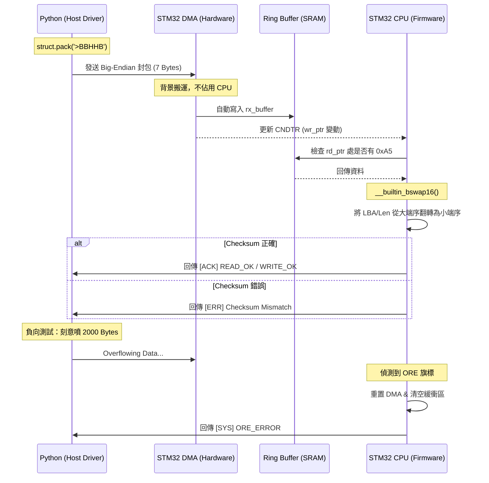
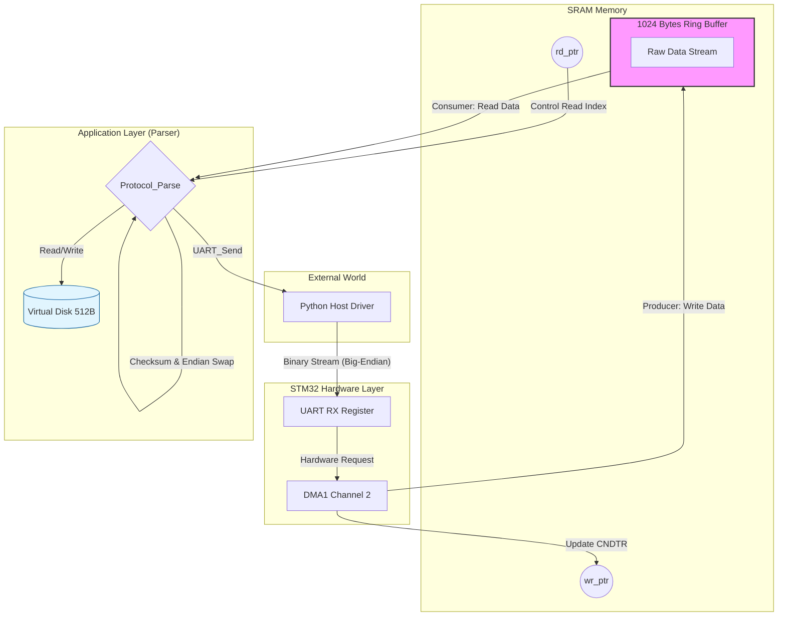

### 系統運作與異常處理狀態圖 (State Diagram)

```mermaid
stateDiagram-v2
    [*] --> System_Init
    System_Init --> Idle : DMA & UART Start

    state Idle {
        [*] --> Check_ORE
        Check_ORE --> Handle_ORE : uart_overrun_occurred == 1
        Handle_ORE --> Check_Pointer : Reset DMA & rd_ptr
        
        Check_ORE --> Check_Pointer : No Error
        Check_Pointer --> Parse_Protocol : rd_ptr != wr_ptr && available >= 7
        Check_Pointer --> Blink_LED : No Data / Incomplete Pkt
        
        state Parse_Protocol {
            [*] --> Sync_Header
            Sync_Header --> Verify_Checksum : byte == 0xA5
            Sync_Header --> Drop_Byte : byte != 0xA5
            Drop_Byte --> Sync_Header : rd_ptr++
            
            Verify_Checksum --> Dispatch_Command : CS Match
            Verify_Checksum --> Error_Response : CS Mismatch
            
            Dispatch_Command --> Execute_Read : Op == 0x01
            Dispatch_Command --> Execute_Write : Op == 0x02
            Dispatch_Command --> Invalid_Op : Others
        }
        
        Parse_Protocol --> Blink_LED
        Blink_LED --> Check_ORE : 500ms Timer
    }
```

### 跨平台通訊與資料轉換時序圖 (Sequence Diagram)

```mermaid
sequenceDiagram
    participant Host as Python (Host Driver)
    participant DMA as STM32 DMA (Hardware)
    participant Buffer as Ring Buffer (SRAM)
    participant CPU as STM32 CPU (Firmware)

    Note over Host: struct.pack('>BBHHB')
    Host->>DMA: 發送 Big-Endian 封包 (7 Bytes)
    
    Note over DMA: 背景搬運，不佔用 CPU
    DMA->>Buffer: 自動寫入 rx_buffer
    DMA-->>CPU: 更新 CNDTR (wr_ptr 變動)

    CPU->>Buffer: 檢查 rd_ptr 處是否有 0xA5
    Buffer-->>CPU: 回傳資料
    
    Note over CPU: __builtin_bswap16()
    CPU->>CPU: 將 LBA/Len 從大端序翻轉為小端序

    alt Checksum 正確
        CPU->>Host: 回傳 [ACK] READ_OK / WRITE_OK
    else Checksum 錯誤
        CPU->>Host: 回傳 [ERR] Checksum Mismatch
    end

    Note over Host: 負向測試：刻意噴 2000 Bytes
    Host->>DMA: Overflowing Data...
    Note over CPU: 偵測到 ORE 旗標
    CPU->>CPU: 重置 DMA & 清空緩衝區
    CPU->>Host: 回傳 [SYS] ORE_ERROR
```

### 生產者-消費者模型架構圖 (UML Class/Architecture)

```mermaid
graph TD
    subgraph "External World"
        PY[Python Host Driver]
    end

    subgraph "STM32 Hardware Layer"
        UART[UART RX Register]
        DMA[DMA1 Channel 2]
    end

    subgraph "SRAM Memory"
        direction TB
        subgraph RingBuffer [1024 Bytes Ring Buffer]
            Data[Raw Data Stream]
        end
        RD_PTR((rd_ptr))
        WR_PTR((wr_ptr))
    end

    subgraph "Application Layer (Parser)"
        Parser{Protocol_Parse}
        Disk[(Virtual Disk 512B)]
    end

    PY -- "Binary Stream (Big-Endian)" --> UART
    UART -- "Hardware Request" --> DMA
    DMA -- "Producer: Write Data" --> RingBuffer
    DMA -- "Update CNDTR" --> WR_PTR

    RingBuffer -- "Consumer: Read Data" --> Parser
    RD_PTR -- "Control Read Index" --> Parser
    
    Parser -- "Checksum & Endian Swap" --> Parser
    Parser -- "Read/Write" --> Disk
    Parser -- "UART_Send" --> PY

    style RingBuffer fill:#f9f,stroke:#333,stroke-width:2px
    style Disk fill:#e1f5fe,stroke:#01579b
```
