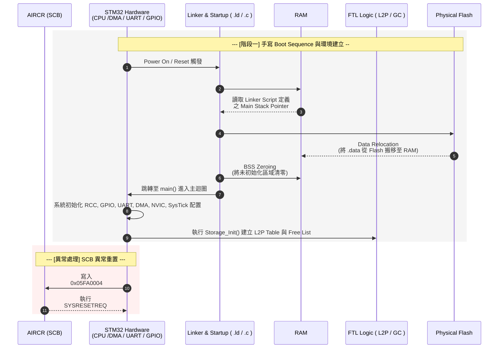
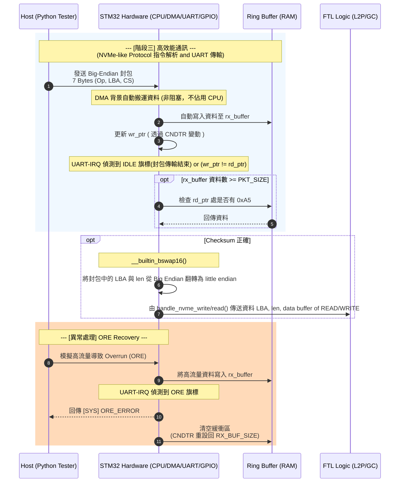
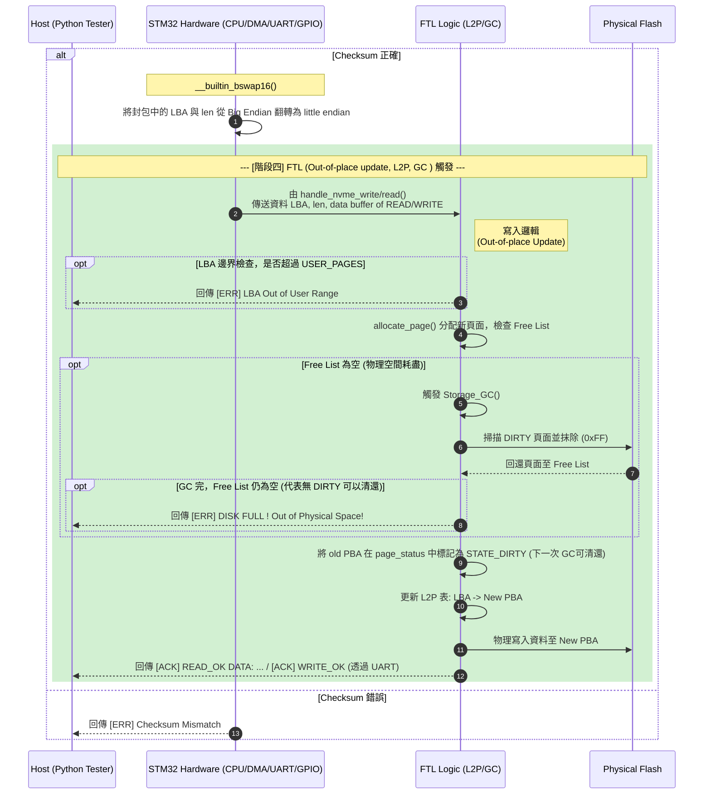

## Sequence Diagram
### Booting

```mermaid
%%{init: { 'themeVariables': { 'fontSize': '24px', 'fontFamily': 'Arial'}}}%%

sequenceDiagram
    autonumber
    
    %% participant PC as Host (Python Tester)
    participant Aircr as AIRCR (SCB)
    %% participant Systick as SysTick 硬體計數器
    participant HW as STM32 Hardware<br/>(CPU /DMA / UART / GPIO)
    %% participant Buffer as Ring Buffer (RAM)
    participant Startup as  Linker & Startup ( .ld / .c )
    participant Ram as RAM
    participant FTL as FTL Logic ( L2P / GC )
    participant Storage as Physical Flash

    rect rgb(245,245,245)
        Note over HW, Storage: --- [階段一] 手寫 Boot Sequence 與環境建立 --
        HW->>Startup: Power On / Reset 觸發
        Startup->>Ram: <br/>
        %% 讀取 Linker Script 定義<br/>之 Main Stack Pointer(MSP)
        Ram-->>Startup: 讀取 Linker Script 定義<br/>之 Main Stack Pointer
        
        Startup->>Storage: <br/>
        %% Data Relocation <br/>(將 .data 從 Flash 搬移至 RAM)
        Storage-->>Ram: Data Relocation <br/>(將 .data 從 Flash 搬移至 RAM)
        Startup->>Ram: BSS Zeroing <br/>(將未初始化區域清零)

        Startup->>HW: 跳轉至 main() 進入主迴圈
        HW->>HW: 系統初始化 RCC, GPIO, UART, DMA, NVIC, SysTick 配置
        HW->>FTL: 執行 Storage_Init() 建立 L2P Table 與 Free List
    end
    
   
    rect rgb(255, 240, 240)
        Note over Aircr, HW: --- [異常處理] SCB 異常重置 ---
        HW->>Aircr: 寫入 <br/>0x05FA0004
        Aircr-->>HW: 執行 <br/>SYSRESETREQ
    end

```

### NVMe-like Protocol + UART + ORE Recovery

```mermaid
%%{init: { 'themeVariables': { 'fontSize': '24px', 'fontFamily': 'Arial'}}}%%

sequenceDiagram
    autonumber
    
    participant PC as Host (Python Tester)
    %% participant Aircr as AIRCR暫存器 (SCB)
    %% participant Systick as SysTick 硬體計數器
    participant HW as STM32 Hardware (CPU/DMA/UART/GPIO)
    participant Buffer as Ring Buffer (RAM)
    %% participant Startup as  Linker & Startup (.ld/.c)
    %% participant Ram as RAM
    participant FTL as FTL Logic (L2P/GC)
    %% participant Storage as Physical Flash

   

    
    rect rgb(240, 248, 255)
        Note over PC, Buffer: --- [階段三] 高效能通訊 ---<br/>(NVMe-like Protocol 指令解析 and UART 傳輸) 

        PC->>HW: 發送 Big-Endian 封包 <br/>7 Bytes (Op, LBA, CS)
        Note over HW: DMA 背景自動搬運資料 (非阻塞，不佔用 CPU)
        HW->>Buffer: 自動寫入資料至 rx_buffer
        HW->>HW: 更新 wr_ptr ( 透過 CNDTR 變動 )
        Note over HW: UART-IRQ 偵測到 IDLE 旗標(封包傳輸結束) or (wr_ptr != rd_ptr)
        opt rx_buffer 資料數 >= PKT_SIZE
            HW->>Buffer: 檢查 rd_ptr 處是否有 0xA5
            Buffer-->>HW: 回傳資料
        end
    end
    

    opt Checksum 正確
        Note over HW: __builtin_bswap16()
        HW->>HW: 將封包中的 LBA 與 len 從 Big Endian 翻轉為 little endian
        HW->>FTL: 由 handle_nvme_write/read() 傳送資料 LBA, len, data buffer of READ/WRITE
    end

    rect rgb(255, 218, 185)
        Note over PC, HW: --- [異常處理] ORE Recovery ---
        PC->>HW: 模擬高流量導致 Overrun (ORE)
        HW->>Buffer: 將高流量資料寫入 rx_buffer
        Note over HW: UART-IRQ 偵測到 ORE 旗標
        HW-->>PC: 回傳 [SYS] ORE_ERROR
        HW->>Buffer: 清空緩衝區<br/>(CNDTR 重設回 RX_BUF_SIZE)
    end

```

### FTL : L2P + GC

```mermaid
%%{init: { 'themeVariables': { 'fontSize': '24px', 'fontFamily': 'Arial'}}}%%

sequenceDiagram
    autonumber
    
    participant PC as Host (Python Tester)
    %% participant Aircr as AIRCR暫存器 (SCB)
    %% participant Systick as SysTick 硬體計數器
    participant HW as STM32 Hardware (CPU/DMA/UART/GPIO)
    %% participant Buffer as Ring Buffer (RAM)
    %% participant Startup as  Linker & Startup (.ld/.c)
    %% participant Ram as RAM
    participant FTL as FTL Logic (L2P/GC)
    participant Storage as Physical Flash


    

    alt Checksum 正確
        Note over HW: __builtin_bswap16()
        HW->>HW: 將封包中的 LBA 與 len 從 Big Endian 翻轉為 little endian
        rect rgb(210, 240, 210)
            Note over PC, Storage: --- [階段四] FTL (Out-of-place update, L2P, GC ) 觸發 ---
            HW->>FTL: 由 handle_nvme_write/read() <br/>傳送資料 LBA, len, data buffer of READ/WRITE
        
            Note right of FTL: 寫入邏輯<br>(Out-of-place Update)
            opt LBA 邊界檢查，是否超過 USER_PAGES
                FTL-->>PC: 回傳 [ERR] LBA Out of User Range
            end
            FTL->>FTL: allocate_page() 分配新頁面，檢查 Free List
            opt Free List 為空 (物理空間耗盡)
                FTL->>FTL: 觸發 Storage_GC()
                FTL->>Storage: 掃描 DIRTY 頁面並抹除 (0xFF)
                Storage-->>FTL: 回還頁面至 Free List
                opt GC 完，Free List 仍為空 (代表無 DIRTY 可以清還)
                    FTL-->>PC: 回傳 [ERR] DISK FULL ! Out of Physical Space!
                end
                
            end
            FTL->>FTL: 將 old PBA 在 page_status 中標記為 STATE_DIRTY (下一次 GC可清還)
            FTL->>FTL: 更新 L2P 表: LBA -> New PBA
            FTL->>Storage: 物理寫入資料至 New PBA
            FTL-->>PC: 回傳 [ACK] READ_OK DATA: ... / [ACK] WRITE_OK (透過 UART)
        end
        
    else Checksum 錯誤
        HW-->>PC: 回傳 [ERR] Checksum Mismatch
    end
    


```
