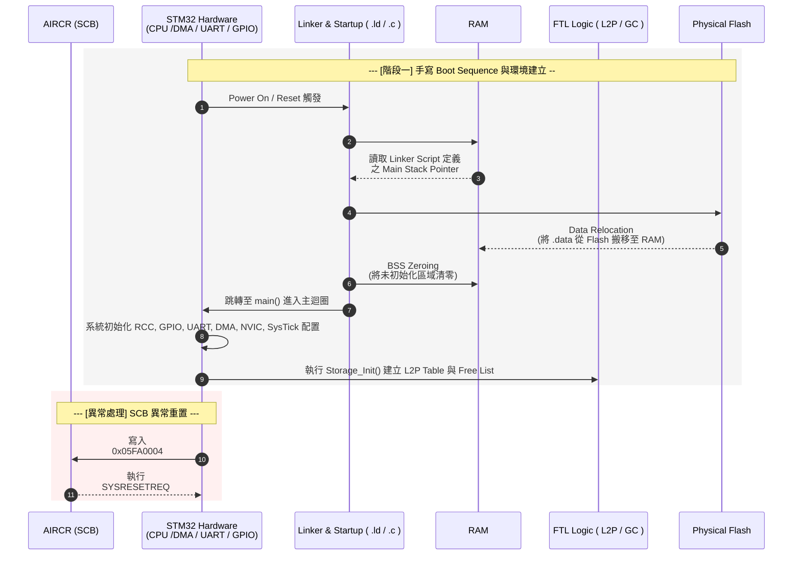

## Sequence Diagram
### Booting

```mermaid
%%{init: { 'themeVariables': { 'fontSize': '24px', 'fontFamily': 'Arial'}}}%%

sequenceDiagram
    autonumber
    
    %% participant PC as Host (Python Tester)
    participant Aircr as AIRCR (SCB)
    %% participant Systick as SysTick 硬體計數器
    participant HW as STM32 Hardware<br/>(CPU /DMA / UART / GPIO)
    %% participant Buffer as Ring Buffer (RAM)
    participant Startup as  Linker & Startup ( .ld / .c )
    participant Ram as RAM
    participant FTL as FTL Logic ( L2P / GC )
    participant Storage as Physical Flash

    rect rgb(245,245,245)
        Note over HW, Storage: --- [階段一] 手寫 Boot Sequence 與環境建立 --
        HW->>Startup: Power On / Reset 觸發
        Startup->>Ram: <br/>
        %% 讀取 Linker Script 定義<br/>之 Main Stack Pointer(MSP)
        Ram-->>Startup: 讀取 Linker Script 定義<br/>之 Main Stack Pointer
        
        Startup->>Storage: <br/>
        %% Data Relocation <br/>(將 .data 從 Flash 搬移至 RAM)
        Storage-->>Ram: Data Relocation <br/>(將 .data 從 Flash 搬移至 RAM)
        Startup->>Ram: BSS Zeroing <br/>(將未初始化區域清零)

        Startup->>HW: 跳轉至 main() 進入主迴圈
        HW->>HW: 系統初始化 RCC, GPIO, UART, DMA, NVIC, SysTick 配置
        HW->>FTL: 執行 Storage_Init() 建立 L2P Table 與 Free List
    end
    
   
    rect rgb(255, 240, 240)
        Note over Aircr, HW: --- [異常處理] SCB 異常重置 ---
        HW->>Aircr: 寫入 <br/>0x05FA0004
        Aircr-->>HW: 執行 <br/>SYSRESETREQ
    end

```
