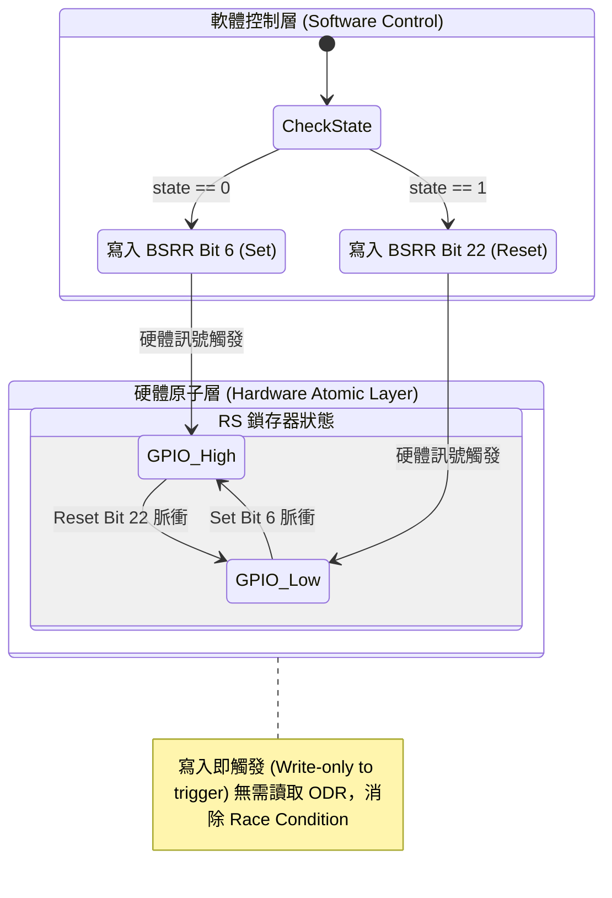
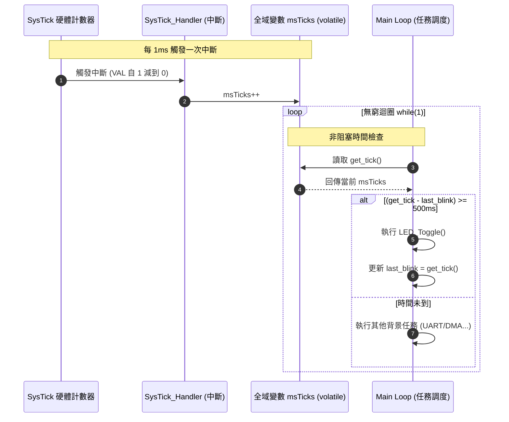

### GPIO BSRR 原子操作狀態圖 (State Diagram)

```mermaid
stateDiagram-v2
    direction TB


    state "軟體控制層 (Software Control)" as SW {
        [*] --> CheckState
        CheckState --> Write_BSRR_Set : state == 0
        CheckState --> Write_BSRR_Reset : state == 1
        
        Write_BSRR_Set: 寫入 BSRR Bit 6 (Set)
        Write_BSRR_Reset: 寫入 BSRR Bit 22 (Reset)
    }

    state "硬體原子層 (Hardware Atomic Layer)" as HW {
        state "RS 鎖存器狀態" as Latch {
            GPIO_Low --> GPIO_High : Set Bit 6 脈衝
            GPIO_High --> GPIO_Low : Reset Bit 22 脈衝
        }
    }

    Write_BSRR_Set --> GPIO_High : 硬體訊號觸發
    Write_BSRR_Reset --> GPIO_Low : 硬體訊號觸發

    note right of HW : 寫入即觸發 (Write-only to trigger) 無需讀取 ODR，消除 Race Condition
```

### SysTick 非阻塞調度時序圖 (Sequence Diagram)

```mermaid
sequenceDiagram
    autonumber
    
    participant HW as SysTick 硬體計數器
    participant ISR as SysTick_Handler (中斷)
    participant VAR as 全域變數 msTicks (volatile)
    participant MAIN as Main Loop (任務調度)

    Note over HW, VAR: 每 1ms 觸發一次中斷
    HW->>ISR: 觸發中斷 (VAL 自 1 減到 0)
    ISR->>VAR: msTicks++
    
    loop 無窮迴圈 while(1)
        Note over MAIN, VAR: 非阻塞時間檢查
        MAIN->>VAR: 讀取 get_tick()
        VAR-->>MAIN: 回傳當前 msTicks
        
        alt (get_tick - last_blink) >= 500ms
            MAIN->>MAIN: 執行 LED_Toggle()
            MAIN->>MAIN: 更新 last_blink = get_tick()
        else 時間未到
            MAIN->>MAIN: 執行其他背景任務 (UART/DMA...)
        end
    end
```
