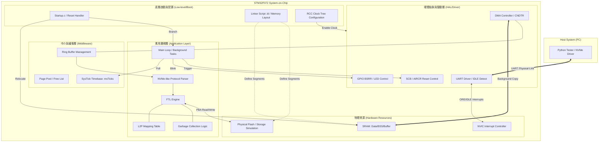
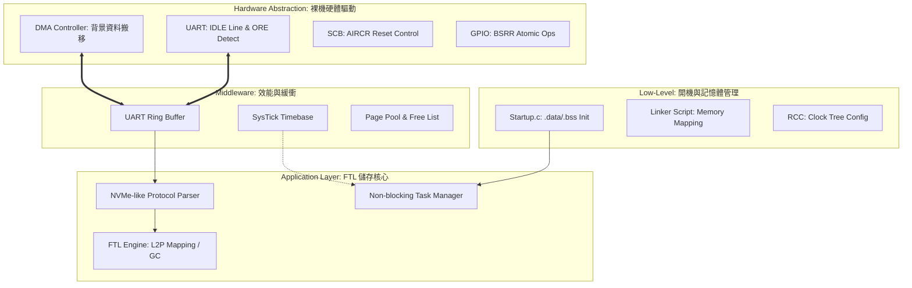
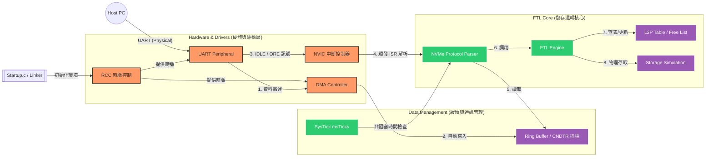
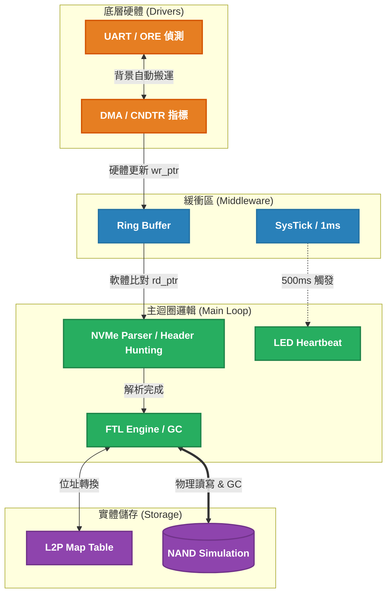

## 系統架構圖
### Version 1

```mermaid
graph TB
    subgraph Host_PC ["Host System (PC)"]
        Python[Python Tester / NVMe Driver]
    end

    subgraph STM32_SoC ["STM32F072 System-on-Chip"]
        
        subgraph App_Layer ["應用邏輯層 (Application Layer)"]
            FTL[FTL Engine]
            L2P[L2P Mapping Table]
            GC[Garbage Collection Logic]
            NVMe_Parser[NVMe-like Protocol Parser]
            Main_Loop[Main Loop / Background Tasks]
        end

        subgraph Middleware_Layer ["中介與緩衝層 (Middleware)"]
            RB[Ring Buffer Management]
            Pool[Page Pool / Free List]
            Tick[SysTick Timebase: msTicks]
        end

        subgraph Driver_HAL_Layer ["硬體抽象與驅動層 (HAL/Driver)"]
            UART_DRV[UART Driver / IDLE Detect]
            DMA_DRV[DMA Controller / CNDTR]
            GPIO_DRV[GPIO BSRR / LED Control]
            SCB_DRV[SCB / AIRCR Reset Control]
        end

        subgraph Low_Level_Layer ["底層啟動與配置 (Low-level/Boot)"]
            Startup[Startup.c / Reset Handler]
            LS[Linker Script .ld / Memory Layout]
            RCC[RCC Clock Tree Configuration]
        end

        subgraph Hardware_Resources ["物理資源 (Hardware Resources)"]
            RAM[SRAM: Data/BSS/Buffer]
            Flash[Physical Flash / Storage Simulation]
            NVIC[NVIC Interrupt Controller]
        end
    end

    %% 資料流與控制流
    Python <==>|UART Physical Link| UART_DRV
    UART_DRV <-->|ORE/IDLE Interrupts| NVIC
    DMA_DRV <==>|Background Copy| RAM
    DMA_DRV --- RB
    RB --> NVMe_Parser
    NVMe_Parser --> FTL
    FTL --- L2P
    FTL --- GC
    FTL <-->|PBA Read/Write| Flash
    Main_Loop -->|Poll| Tick
    Main_Loop -->|Blink| GPIO_DRV
    Main_Loop -->|Trigger| SCB_DRV
    
    Startup -->|Relocate| RAM
    Startup -->|Branch| Main_Loop
    LS -.->|Define Segments| RAM
    LS -.->|Define Segments| Flash
    RCC -->|Enable Clock| Driver_HAL_Layer

```

### Version 2

```mermaid
graph TD
    subgraph "Application Layer: FTL 儲存核心"
        Parser[NVMe-like Protocol Parser]
        FTL[FTL Engine: L2P Mapping / GC]
        Logic[Non-blocking Task Manager]
    end

    subgraph "Middleware: 效能與緩衝"
        RB[UART Ring Buffer]
        Tick[SysTick Timebase]
        Pool[Page Pool & Free List]
    end

    subgraph "Hardware Abstraction: 裸機硬體驅動"
        DMA[DMA Controller: 背景資料搬移]
        UART[UART: IDLE Line & ORE Detect]
        SCB[SCB: AIRCR Reset Control]
        GPIO[GPIO: BSRR Atomic Ops]
    end

    subgraph "Low-Level: 開機與記憶體管理"
        Startup[Startup.c: .data/.bss Init]
        Linker[Linker Script: Memory Mapping]
        RCC[RCC: Clock Tree Config]
    end

    %% 控制流
    Startup --> Logic
    UART <==> RB
    DMA <==> RB
    RB --> Parser
    Parser --> FTL
    Tick -.-> Logic
```

### Version 3

```mermaid
graph LR
    %% 定義風格
    classDef hardware fill:#f96,stroke:#333,stroke-width:2px;
    classDef driver fill:#3498db,stroke:#fff,color:#fff;
    classDef logic fill:#2ecc71,stroke:#fff,color:#fff;
    classDef mem fill:#9b59b6,stroke:#fff,color:#fff;

    %% 外部輸入
    Host((Host PC)) -- "UART (Physical)" --> UART

    subgraph "Hardware & Drivers (硬體與驅動層)"
        UART[UART Peripheral]:::hardware
        DMA[DMA Controller]:::hardware
        NVIC[NVIC 中斷控制器]:::hardware
        RCC[RCC 時脈控制]:::hardware
    end

    subgraph "Data Management (緩衝與通訊管理)"
        RB[Ring Buffer / CNDTR 指標]:::mem
        Tick[SysTick msTicks]:::logic
    end

    subgraph "FTL Core (儲存邏輯核心)"
        Parser[NVMe Protocol Parser]:::logic
        FTL[FTL Engine]:::logic
        L2P[L2P Table / Free List]:::mem
        Storage[Storage Simulation]:::mem
    end

    %% 核心關聯線
    RCC -- "提供時脈" --> UART
    RCC -- "提供時脈" --> DMA
    
    UART -- "1. 資料搬運" --> DMA
    DMA -- "2. 自動寫入" --> RB
    
    UART -- "3. IDLE / ORE 訊號" --> NVIC
    NVIC -- "4. 觸發 ISR 解析" --> Parser
    
    Parser -- "5. 讀取" --> RB
    Parser -- "6. 調用" --> FTL
    
    FTL -- "7. 查表/更新" --> L2P
    FTL -- "8. 物理存取" --> Storage
    
    Tick -- "非阻塞時間檢查" --> Parser

    %% 開機關聯
    Startup[[Startup.c / Linker]] -- "初始化環境" --> RCC


```

### Version 4

```mermaid
graph LR
    %% 全域風格設定
    classDef hardware fill:#E67E22,stroke:#D35400,stroke-width:2px,color:#fff,font-weight:bold;
    classDef logic fill:#27AE60,stroke:#1E8449,stroke-width:2px,color:#fff,font-weight:bold;
    classDef buffer fill:#2980B9,stroke:#2471A3,stroke-width:2px,color:#fff,font-weight:bold;
    classDef storage fill:#8E44AD,stroke:#71338A,stroke-width:2px,color:#fff,font-weight:bold;

    %% 外部輸入
    PC((Host PC)) -- "UART Link" --> UART

    subgraph Hardware ["底層硬體與驅動"]
        UART[UART / IDLE]:::hardware
        DMA[DMA Controller]:::hardware
        NVIC[NVIC 中斷控制]:::hardware
    end

    subgraph Buffer ["通訊與時間管理"]
        RB[Ring Buffer]:::buffer
        Tick[SysTick / 1ms]:::buffer
    end

    subgraph FTL_Core ["FTL 核心演算法"]
        Parser[NVMe Parser]:::logic
        FTL[FTL Engine]:::logic
        
        subgraph GC_Module ["GC & 資源管理"]
            GC[Garbage Collection]:::storage
            Pool[Page Pool / Free List]:::storage
        end
    end

    subgraph Memory ["實體存取層"]
        L2P[L2P Map Table]:::storage
        Flash[NAND Simulation]:::storage
    end

    %% 連接關係 (強化關聯性)
    UART <-->|背景傳輸| DMA
    DMA -->|CNDTR 指標| RB
    UART -.->|IDLE/ORE| NVIC
    NVIC -->|觸發解析| Parser
    
    RB -->|指令流| Parser
    Parser -->|調用| FTL
    
    FTL <-->|1. 檢查空間| Pool
    Pool -.->|2. 空間不足| GC
    GC -->|3. 掃描 & 抹除| Flash
    GC -.->|4. 回還 Page| Pool
    
    FTL <-->|5. 位址轉換| L2P
    FTL -->|6. 物理寫入| Flash

    Tick -.->|非阻塞 Check| Parser

```

### Version 5

```mermaid
graph LR
    %% 全域風格設定
    classDef hardware fill:#E67E22,stroke:#D35400,stroke-width:2px,color:#fff,font-weight:bold;
    classDef logic fill:#27AE60,stroke:#1E8449,stroke-width:2px,color:#fff,font-weight:bold;
    classDef buffer fill:#2980B9,stroke:#2471A3,stroke-width:2px,color:#fff,font-weight:bold;
    classDef storage fill:#8E44AD,stroke:#71338A,stroke-width:2px,color:#fff,font-weight:bold;

    %% 外部輸入
    PC((Host PC)) == "UART Link" ==> UART

    subgraph Hardware ["底層驅動層 (Drivers)"]
        UART[UART / IDLE]:::hardware
        DMA[DMA / CNDTR]:::hardware
        NVIC[NVIC 中斷控制]:::hardware
    end

    subgraph Buffer ["緩衝與管理 (Middleware)"]
        RB[Ring Buffer]:::buffer
        Tick[SysTick / 1ms]:::buffer
    end

    subgraph FTL_Core ["FTL 核心演算法 (Application)"]
        Parser[NVMe Parser]:::logic
        FTL[FTL Engine]:::logic
        
        subgraph GC_Module ["GC & 資源管理"]
            GC[Garbage Collection]:::storage
            Pool[Page Pool / Free List]:::storage
        end
    end

    subgraph Memory ["實體存取層 (Storage)"]
        L2P[L2P Map Table]:::storage
        Flash[NAND Simulation]:::storage
    end

    %% 連接關係 (強化關聯性)
    UART <-->|背景搬運| DMA
    DMA -->|更新指標| RB
    UART -.->|IDLE/ORE| NVIC
    NVIC -->|觸發異常處理或解析| Parser
    
    RB -->|指令流| Parser
    Parser -->|解析後調用| FTL
    
    FTL <-->|1. 檢查空間| Pool
    Pool -.->|2. 空間不足| GC
    GC <-->|3. 數據搬移 & 抹除| Flash
    GC -.->|4. 回還 Page| Pool
    
    FTL <-->|5. 位址轉換| L2P
    FTL <==>|6. 物理讀寫| Flash

    Tick -.->|非阻塞時間 Check| Parser

```

### Version 6

```mermaid
graph TD
    %% 風格設定 (讓區塊大、字體粗)
    classDef hardware fill:#E67E22,stroke:#D35400,stroke-width:2px,color:#fff,font-weight:bold;
    classDef logic fill:#27AE60,stroke:#1E8449,stroke-width:2px,color:#fff,font-weight:bold;
    classDef buffer fill:#2980B9,stroke:#2471A3,stroke-width:2px,color:#fff,font-weight:bold;
    classDef storage fill:#8E44AD,stroke:#71338A,stroke-width:2px,color:#fff,font-weight:bold;

    subgraph Hardware_Layer ["底層硬體 (Drivers)"]
        UART[UART / ORE 偵測]:::hardware
        DMA[DMA / CNDTR 指標]:::hardware
    end

    subgraph Buffer_Layer ["緩衝區 (Middleware)"]
        RB[Ring Buffer]:::buffer
        Tick[SysTick / 1ms]:::buffer
    end

    subgraph Application ["主迴圈邏輯 (Main Loop)"]
        Parser[NVMe Parser / Header Hunting]:::logic
        LED[LED Heartbeat]:::logic
        FTL[FTL Engine / GC]:::logic
    end

    subgraph Storage_Layer ["實體儲存 (Storage)"]
        L2P[L2P Map Table]:::storage
        Flash[(NAND Simulation)]:::storage
    end

    %% 資料流與控制連線
    UART <-->|背景自動搬運| DMA
    DMA -->|硬體更新 wr_ptr| RB
    RB -->|軟體比對 rd_ptr| Parser
    
    %% Tick 僅作為 LED 的時間參考
    Tick -.->|500ms 觸發| LED
    
    Parser -->|解析完成| FTL
    
    %% FTL 與實體層的關係
    FTL <-->|位址轉換| L2P
    FTL <==>|物理讀寫 & GC| Flash

```
