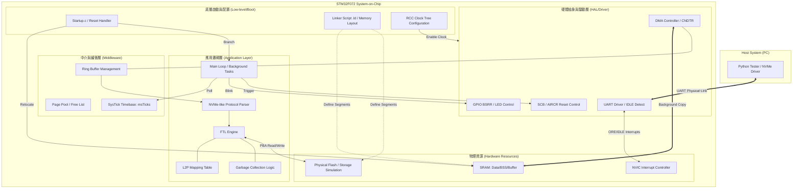

## 系統架構圖

```mermaid
graph TB
    subgraph Host_PC ["Host System (PC)"]
        Python[Python Tester / NVMe Driver]
    end

    subgraph STM32_SoC ["STM32F072 System-on-Chip"]
        
        subgraph App_Layer ["應用邏輯層 (Application Layer)"]
            FTL[FTL Engine]
            L2P[L2P Mapping Table]
            GC[Garbage Collection Logic]
            NVMe_Parser[NVMe-like Protocol Parser]
            Main_Loop[Main Loop / Background Tasks]
        end

        subgraph Middleware_Layer ["中介與緩衝層 (Middleware)"]
            RB[Ring Buffer Management]
            Pool[Page Pool / Free List]
            Tick[SysTick Timebase: msTicks]
        end

        subgraph Driver_HAL_Layer ["硬體抽象與驅動層 (HAL/Driver)"]
            UART_DRV[UART Driver / IDLE Detect]
            DMA_DRV[DMA Controller / CNDTR]
            GPIO_DRV[GPIO BSRR / LED Control]
            SCB_DRV[SCB / AIRCR Reset Control]
        end

        subgraph Low_Level_Layer ["底層啟動與配置 (Low-level/Boot)"]
            Startup[Startup.c / Reset Handler]
            LS[Linker Script .ld / Memory Layout]
            RCC[RCC Clock Tree Configuration]
        end

        subgraph Hardware_Resources ["物理資源 (Hardware Resources)"]
            RAM[SRAM: Data/BSS/Buffer]
            Flash[Physical Flash / Storage Simulation]
            NVIC[NVIC Interrupt Controller]
        end
    end

    %% 資料流與控制流
    Python <==>|UART Physical Link| UART_DRV
    UART_DRV <-->|ORE/IDLE Interrupts| NVIC
    DMA_DRV <==>|Background Copy| RAM
    DMA_DRV --- RB
    RB --> NVMe_Parser
    NVMe_Parser --> FTL
    FTL --- L2P
    FTL --- GC
    FTL <-->|PBA Read/Write| Flash
    Main_Loop -->|Poll| Tick
    Main_Loop -->|Blink| GPIO_DRV
    Main_Loop -->|Trigger| SCB_DRV
    
    Startup -->|Relocate| RAM
    Startup -->|Branch| Main_Loop
    LS -.->|Define Segments| RAM
    LS -.->|Define Segments| Flash
    RCC -->|Enable Clock| Driver_HAL_Layer

```
