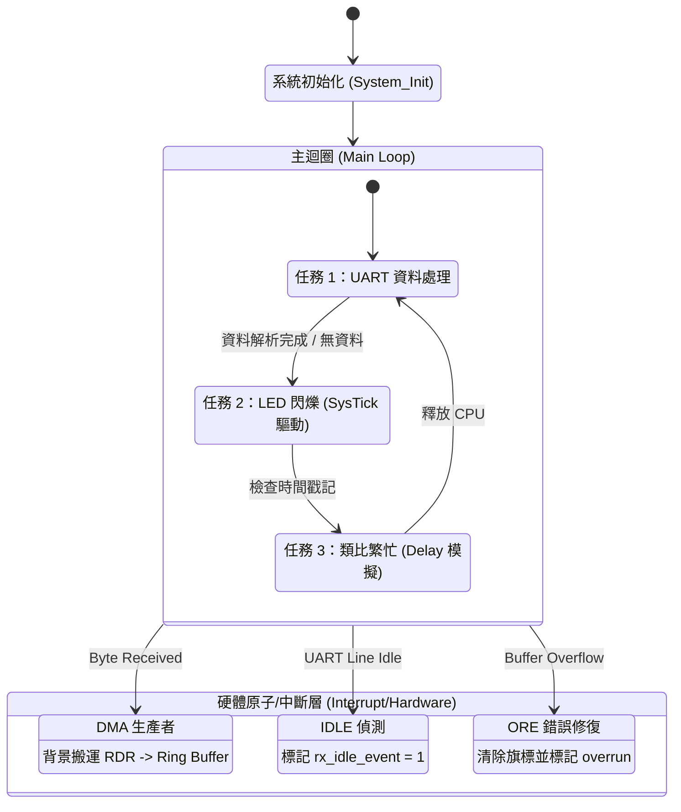
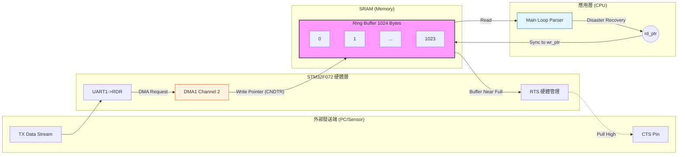
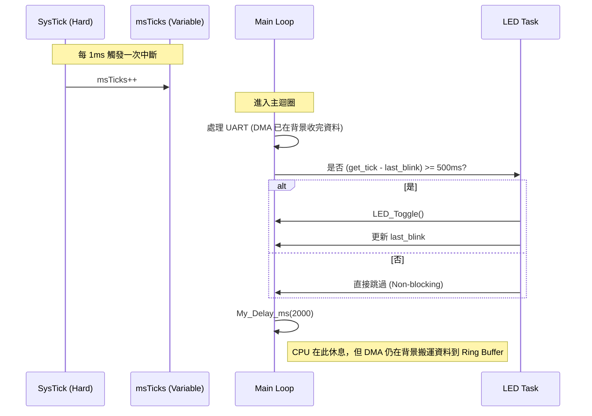

### UART 非阻斷式系統狀態圖 (State Diagram)

```mermaid
stateDiagram-v2
    direction TB

    state "系統初始化 (System_Init)" as Init
    state "主迴圈 (Main Loop)" as MainLoop {
        state "任務 1：UART 資料處理" as Task1
        state "任務 2：LED 閃爍 (SysTick 驅動)" as Task2
        state "任務 3：類比繁忙 (Delay 模擬)" as Task3

        [*] --> Task1
        Task1 --> Task2 : 資料解析完成 / 無資料
        Task2 --> Task3 : 檢查時間戳記
        Task3 --> Task1 : 釋放 CPU
    }

    state "硬體原子/中斷層 (Interrupt/Hardware)" as HW {
        state "DMA 生產者" as DMA_Worker
        state "IDLE 偵測" as IDLE_ISR
        state "ORE 錯誤修復" as ORE_ISR

        DMA_Worker: 背景搬運 RDR -> Ring Buffer
        IDLE_ISR: 標記 rx_idle_event = 1
        ORE_ISR: 清除旗標並標記 overrun
    }

    [*] --> Init
    Init --> MainLoop
    
    %% 中斷觸發關係
    MainLoop --> IDLE_ISR : UART Line Idle
    MainLoop --> ORE_ISR : Buffer Overflow
    MainLoop --> DMA_Worker : Byte Received
```

### DMA Ring Buffer 與雙流控架構圖 (Architecture Diagram)

```mermaid
graph LR
    subgraph "外部發送端 (PC/Sensor)"
        Sender[TX Data Stream]
        CTS_Line[CTS Pin]
    end

    subgraph "STM32F072 硬體層"
        UART_RX[UART1->RDR]
        RTS_Ctrl[RTS 硬體管理]
        DMA_Ctrl[DMA1 Channel 2]
    end

    subgraph "SRAM (Memory)"
        direction TB
        subgraph RingBuffer [Ring Buffer 1024 Bytes]
            Buf0[0]
            Buf1[1]
            Buf2[...]
            Buf1023[1023]
        end
    end

    subgraph "應用層 (CPU)"
        App[Main Loop Parser]
        RD_Ptr((rd_ptr))
    end

    %% 資料流向
    Sender --> UART_RX
    UART_RX -- "DMA Request" --> DMA_Ctrl
    DMA_Ctrl -- "Write Pointer (CNDTR)" --> RingBuffer
    RingBuffer -- "Read" --> App
    
    %% 流控反饋
    RingBuffer -- "Buffer Near Full" --> RTS_Ctrl
    RTS_Ctrl -. "Pull High" .-> CTS_Line
    App -- "Disaster Recovery" --> RD_Ptr
    RD_Ptr -- "Sync to wr_ptr" --> RingBuffer

    %% 標註
    style RingBuffer fill:#f9f,stroke:#333,stroke-width:2px
    style App fill:#e1f5fe,stroke:#01579b
    style DMA_Ctrl fill:#fff3e0,stroke:#e65100
```
### SysTick 非阻塞式調度邏輯 (UML Activity Diagram)

```mermaid
sequenceDiagram
    participant ST as SysTick (Hard)
    participant MS as msTicks (Variable)
    participant Main as Main Loop
    participant LED as LED Task

    Note over ST, MS: 每 1ms 觸發一次中斷
    ST->>MS: msTicks++
    
    Note over Main: 進入主迴圈
    Main->>Main: 處理 UART (DMA 已在背景收完資料)
    
    Main->>LED: 是否 (get_tick - last_blink) >= 500ms?
    alt 是
        LED->>Main: LED_Toggle()
        LED->>Main: 更新 last_blink
    else 否
        LED->>Main: 直接跳過 (Non-blocking)
    end

    Main->>Main: My_Delay_ms(2000)
    Note right of Main: CPU 在此休息，但 DMA 仍在背景搬運資料到 Ring Buffer
```
