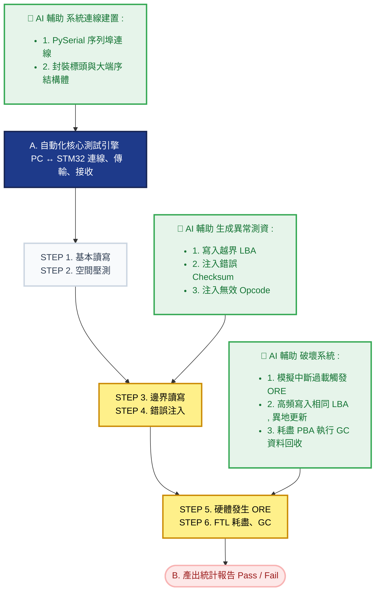
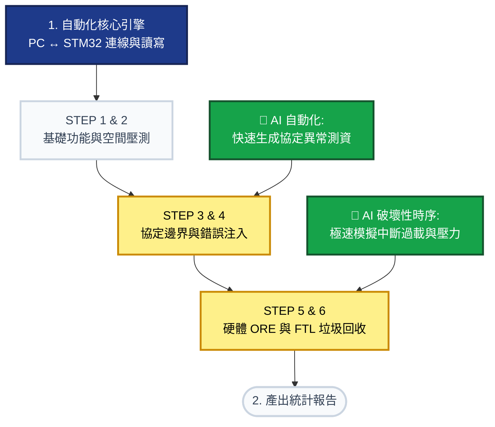
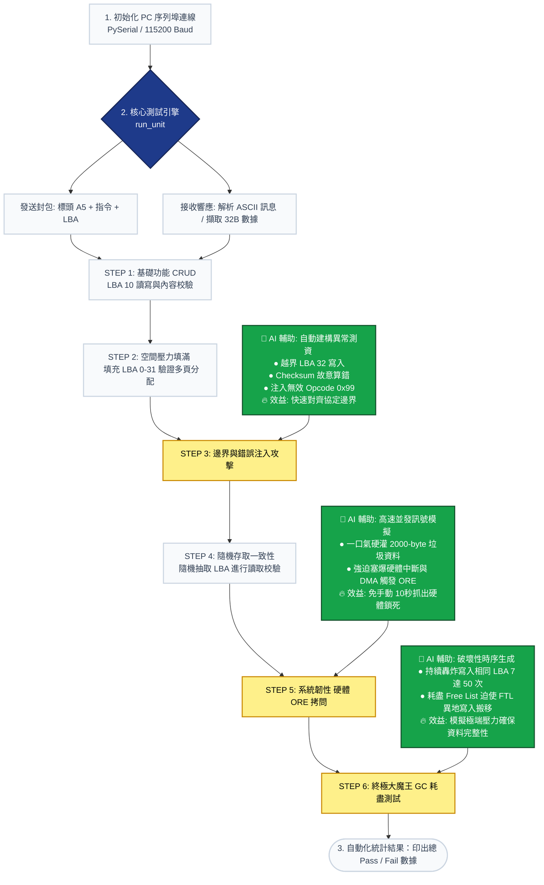
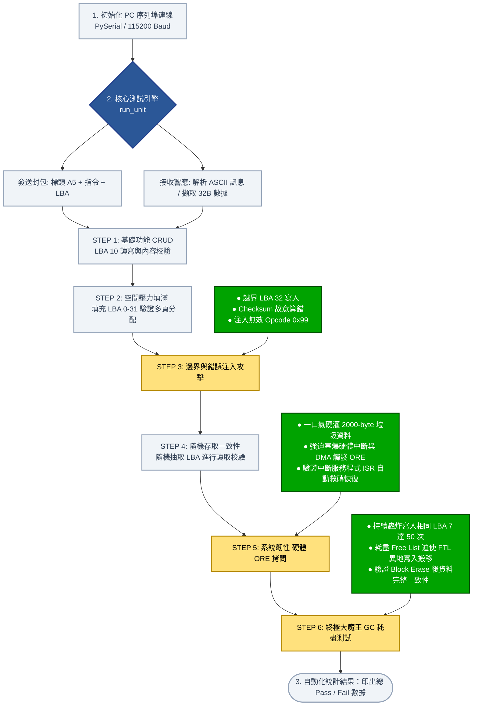

```mermaid
graph TD
    %% ==========================================
    %% 【左/上方】底層驅動與協議實作（AI 強力輔助）
    %% ==========================================
    AI_Comm["🤖 AI 輔助 系統連線建置 :<ul style='text-align:left'><li>1. PySerial 序列埠連線</li><li>2. 封裝標頭與大端序結構體</li></ul>"]:::ai
    
    %% AI_Tx[🤖 AI 自動化: <br> 快速封裝 A5 標頭與大端序結構體]:::ai
    %% AI_Rx[🤖 AI 自動化: <br> 快速實作非阻塞接收與 32B 解析]:::ai

    %% 連線指向核心引擎
    AI_Comm --> Core
    %% AI_Tx --> Core
    %% AI_Rx --> Core

    %% ==========================================
    %% 【中央主幹】核心架構與大底階梯（工程師主導定義）
    %% ==========================================
    Core[A. 自動化核心測試引擎 <br> PC ↔ STM32 連線、傳輸、接收]:::engineer
    
    Core --> Step1[STEP 1. 基本讀寫<br> STEP 2. 空間壓測]:::process
    Step1 --> Step2[STEP 3. 邊界讀寫<br> STEP 4. 錯誤注入]:::highlight
    Step2 --> Step3[STEP 5. 硬體發生 ORE<br>STEP 6. FTL 耗盡、GC]:::highlight
    
    %% ==========================================
    %% 【右側切入】極端異常與壓力注入（AI 破壞性生成）
    %% ==========================================
    %% AI1[🤖 AI 異常測資: <br> 自動注入算錯的 Checksum]:::ai --> Step2
    AI1["🤖 AI 輔助 生成異常測資 :<ul style='text-align:left'><li>1. 寫入越界 LBA</li><li>2. 注入錯誤 Checksum </li><li>3. 注入無效 Opcode </li></ul>"]:::ai--> Step2

    %% AI2[🤖 AI 破壞性時序: <br> 模擬中斷過載與 50次高頻寫入]:::ai --> Step3
    AI2["🤖 AI 輔助 破壞系統 :<ul style='text-align:left'><li>1. 模擬中斷過載觸發 ORE </li><li>2. 高頻寫入相同 LBA , 異地更新</li><li>3. 耗盡 PBA 執行 GC 資料回收 </li></ul>"]:::ai--> Step3
    
    %% 結束
    Step3 --> End([B. 產出統計報告 Pass / Fail ]):::output

    %% ==========================================
    %% PPT 高對比度色彩配置
    %% ==========================================
    classDef engineer fill:#1e3a8a,stroke:#172554,stroke-width:2.5px,color:#fff;
    %% classDef ai fill:#16a34a,stroke:#14532d,stroke-width:2.5px,color:#fff;
    classDef ai fill:#e6f4ea,stroke:#34a853,stroke-width:2.5px,color:#137333;
    classDef process fill:#f8fafc,stroke:#cbd5e1,stroke-width:2.5px,color:#334155;
    classDef highlight fill:#fef08a,stroke:#ca8a04,stroke-width:2.5px,color:#000;
    classDef output fill:#fde8e8,stroke:#f8b4b4,stroke-width:2.5px,color:#9b1c1c;
```

```mermaid
graph TD
    %% 核心架構（工程師主導）
    Core[1. 自動化核心引擎 <br> PC ↔ STM32 連線與讀寫]:::engineer
    
    %% 三大驗證階梯
    Core --> Step1[STEP 1 & 2 <br> 基礎功能與空間壓測]:::process
    Step1 --> Step2[STEP 3 & 4 <br> 協定邊界與錯誤注入]:::highlight
    Step2 --> Step3[STEP 5 & 6 <br> 硬體 ORE 與 FTL 垃圾回收]:::highlight
    
    %% AI 效率加速（右側並行切入）
    AI1[🤖 AI 自動化: <br> 快速生成協定異常測資]:::ai --> Step2
    AI2[🤖 AI 破壞性時序: <br> 極速模擬中斷過載與壓力]:::ai --> Step3
    
    %% 結束
    Step3 --> End([2. 產出統計報告]):::process

    %% ==========================================
    %% PPT 高對比度色彩配置
    %% ==========================================
    classDef engineer fill:#1e3a8a,stroke:#172554,stroke-width:2.5px,color:#fff;
    classDef ai fill:#16a34a,stroke:#14532d,stroke-width:2.5px,color:#fff;
    classDef process fill:#f8fafc,stroke:#cbd5e1,stroke-width:2.5px,color:#334155;
    classDef highlight fill:#fef08a,stroke:#ca8a04,stroke-width:2.5px,color:#000;
```

```mermaid
graph TD
    %% 流程主幹（工程師主導的框架與核心引擎）
    Init[1. 初始化 PC 序列埠連線 <br> PySerial / 115200 Baud] --> Engine{2. 核心測試引擎 <br> run_unit}
    
    Engine --> Tx[發送封包: 標頭 A5 + 指令 + LBA]
    Engine --> Rx[接收響應: 解析 ASCII 訊息 / 擷取 32B 數據]

    %% 六大測試階梯主幹
    Tx --> Step1[STEP 1: 基礎功能 CRUD <br> LBA 10 讀寫與內容校驗]
    Rx --> Step1
    
    Step1 --> Step2[STEP 2: 空間壓力填滿 <br> 填充 LBA 0-31 驗證多頁分配]
    
    %% 【AI 加速切入點 1】
    Step2 --> Step3[STEP 3: 邊界與錯誤注入攻擊]
    Inject1[🤖 AI 輔助: 自動建構異常測資 <br>● 越界 LBA 32 寫入<br>● Checksum 故意算錯<br>● 注入無效 Opcode 0x99<br>🔥 效益: 快速對齊協定邊界] --> Step3

    Step3 --> Step4[STEP 4: 隨機存取一致性 <br> 隨機抽取 LBA 進行讀取校驗]

    %% 【AI 加速切入點 2】
    Step4 --> Step5[STEP 5: 系統韌性 硬體 ORE 拷問]
    Inject2[🤖 AI 輔助: 高速並發訊號模擬 <br>● 一口氣硬灌 2000-byte 垃圾資料<br>● 強迫塞爆硬體中斷與 DMA 觸發 ORE<br>🔥 效益: 免手動 10秒抓出硬體鎖死] --> Step5

    %% 【AI 加速切入點 3】
    Step5 --> Step6[STEP 6: 終極大魔王 GC 耗盡測試]
    Inject3[🤖 AI 輔助: 破壞性時序生成 <br>● 持續轟炸寫入相同 LBA 7 達 50 次<br>● 耗盡 Free List 迫使 FTL 異地寫入搬移<br>🔥 效益: 模擬極端壓力確保資料完整性] --> Step6

    %% 結束
    Step6 --> End([3. 自動化統計結果：印出總 Pass / Fail 數據])

    %% ==========================================
    %% 樣式配置（增強色彩對比度，凸顯 AI 的綠色軌道）
    %% ==========================================
    classDef engineer fill:#1e3a8a,stroke:#172554,stroke-width:2px,color:#fff;
    classDef ai fill:#16a34a,stroke:#14532d,stroke-width:2px,color:#fff;
    classDef process fill:#f8fafc,stroke:#cbd5e1,stroke-width:2px,color:#334155;
    classDef highlight fill:#fef08a,stroke:#ca8a04,stroke-width:2px,color:#000;

    %% 指派樣式
    class Init,Tx,Rx,Step1,Step2,Step4,End process;
    class Engine engineer;
    class Inject1,Inject2,Inject3 ai;
    class Step3,Step5,Step6 highlight;
```

```mermaid
graph TD
    %% 流程主幹與箭頭連線
    %% Start([開始：系統級閉環自動化驗證]) --> 
    Init[1. 初始化 PC 序列埠連線 <br> PySerial / 115200 Baud]

    %% 核心引擎一體化
    Init --> Engine{2. 核心測試引擎 <br> run_unit}
    Engine --> Tx[發送封包: 標頭 A5 + 指令 + LBA]
    Engine --> Rx[接收響應: 解析 ASCII 訊息 / 擷取 32B 數據]

    %% 六大測試階梯
    Tx --> Step1[STEP 1: 基礎功能 CRUD <br> LBA 10 讀寫與內容校驗]
    Rx --> Step1
    
    Step1 --> Step2[STEP 2: 空間壓力填滿 <br> 填充 LBA 0-31 驗證多頁分配]
    
    %% AI 槓桿切入點 1
    Step2 --> Step3[STEP 3: 邊界與錯誤注入攻擊]
    Inject1[● 越界 LBA 32 寫入<br>● Checksum 故意算錯<br>● 注入無效 Opcode 0x99] --> Step3

    Step3 --> Step4[STEP 4: 隨機存取一致性 <br> 隨機抽取 LBA 進行讀取校驗]

    %% AI 槓桿切入點 2
    Step4 --> Step5[STEP 5: 系統韌性 硬體 ORE 拷問]
    Inject2[● 一口氣硬灌 2000-byte 垃圾資料<br>● 強迫塞爆硬體中斷與 DMA 觸發 ORE<br>● 驗證中斷服務程式 ISR 自動救磚恢復] --> Step5

    %% AI 槓桿切入點 3
    Step5 --> Step6[STEP 6: 終極大魔王 GC 耗盡測試]
    Inject3[● 持續轟炸寫入相同 LBA 7 達 50 次<br>● 耗盡 Free List 迫使 FTL 異地寫入搬移<br>● 驗證 Block Erase 後資料完整一致性] --> Step6

    %% 結束
    Step6 --> End([3. 自動化統計結果：印出總 Pass / Fail 數據])

    %% ==========================================
    %% 樣式配置
    %% ==========================================
    classDef engineer fill:#2b5797,stroke:#1e3a8a,stroke-width:2px,color:#fff;
    classDef ai fill:#00a300,stroke:#004d00,stroke-width:2px,color:#fff;
    classDef process fill:#f0f4f8,stroke:#94a3b8,stroke-width:2px,color:#334155;
    classDef highlight fill:#ffe17d,stroke:#b58900,stroke-width:2px,color:#000;

    %% 指派樣式給各個節點
    class Start,Init,Tx,Rx,Step1,Step2,Step4,End process;
    class Engine engineer;
    class Inject1,Inject2,Inject3 ai;
    class Step3,Step5,Step6 highlight;
```
